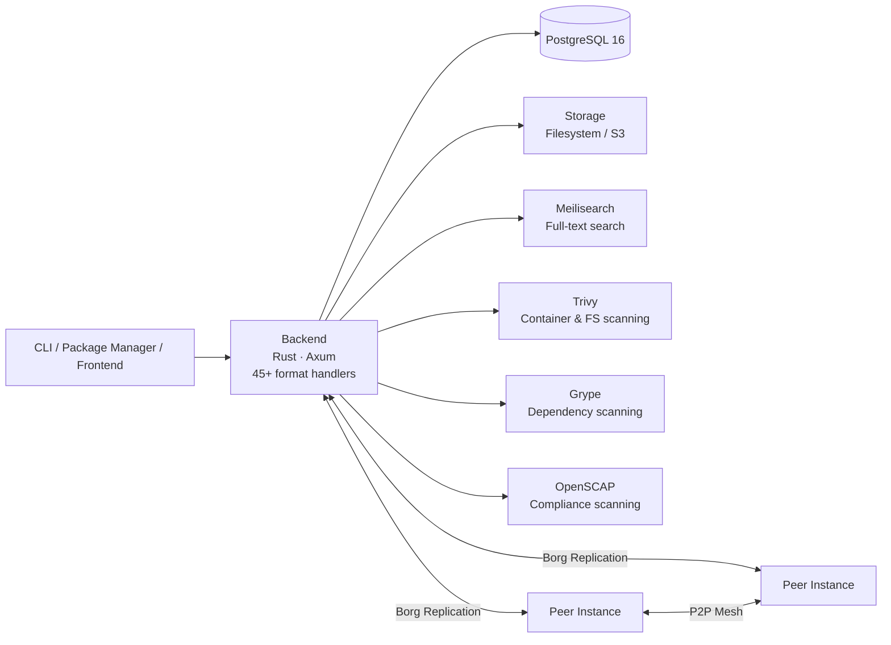
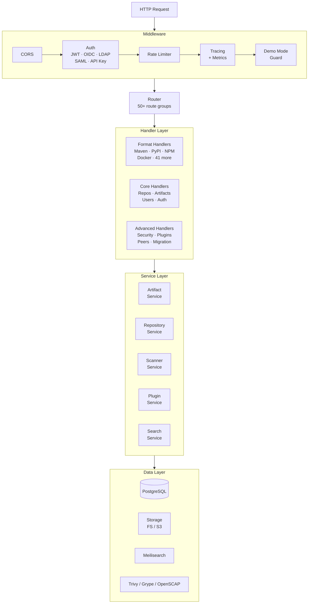
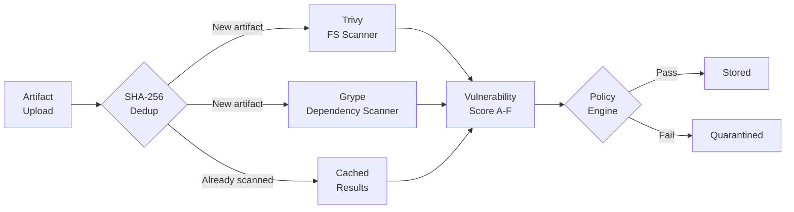
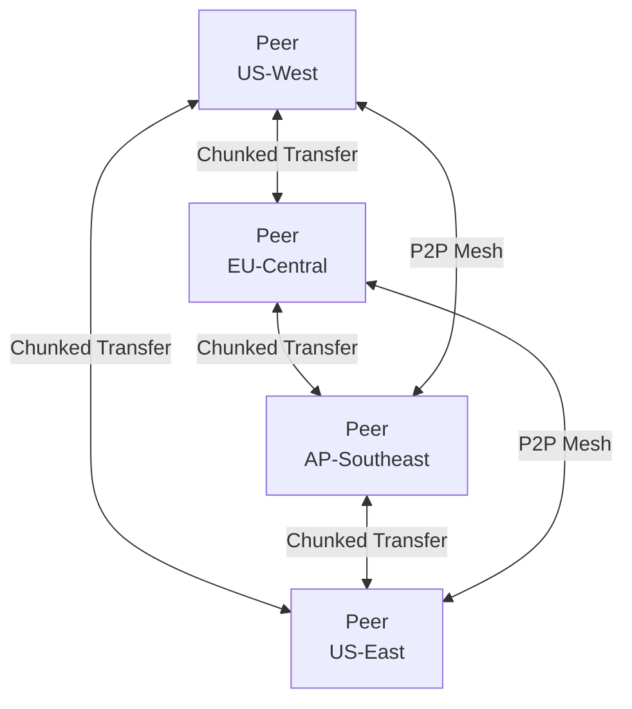
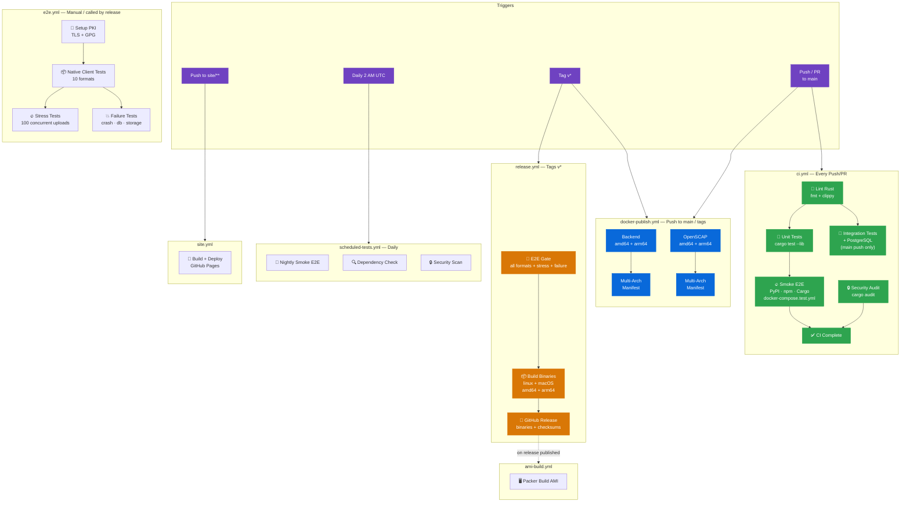

# Artifact Keeper

[](https://github.com/artifact-keeper/artifact-keeper/actions/workflows/ci.yml)
[](https://sonarcloud.io/dashboard?id=artifact-keeper_artifact-keeper)
[](https://sonarcloud.io/dashboard?id=artifact-keeper_artifact-keeper)
[](https://sonarcloud.io/dashboard?id=artifact-keeper_artifact-keeper)
[](https://sonarcloud.io/dashboard?id=artifact-keeper_artifact-keeper)
[](LICENSE)
[](https://www.rust-lang.org/)
[](https://hub.docker.com/u/artifactkeeper)
[](https://github.com/sponsors/artifact-keeper)

An enterprise-grade, open-source artifact registry supporting **45+ package formats**. Built with Rust.

[Documentation](https://artifactkeeper.com/docs/) | [Demo](https://demo.artifactkeeper.com) | [Website](https://artifactkeeper.com)

## Highlights

- **45+ Package Formats** - Native protocol support for Maven, PyPI, NPM, Docker/OCI, Cargo, Go, Helm, and 38 more
- **WASM Plugin System** - Extend with custom format handlers via WebAssembly (WIT-based, Wasmtime runtime)
- **Security Scanning** - Automated vulnerability detection with Trivy and Grype, policy engine, quarantine workflow
- **Hardened Containers** - All images built on [DISA STIG](https://www.cyber.mil/stigs/)-approved Red Hat UBI 9 base images, non-root execution, no shell or package manager in runtime
- **Borg Replication** - Recursive peer mesh with swarm-based artifact distribution and P2P transfers
- **Full-Text Search** - Meilisearch-powered search across all repositories and artifacts
- **Multi-Auth** - JWT, OpenID Connect, LDAP, SAML 2.0, and API token support
- **Artifactory Migration** - Built-in tooling to migrate repositories, artifacts, and permissions from JFrog Artifactory
- **Artifact Signing** - GPG and RSA signing integrated into Debian, RPM, Alpine, and Conda handlers

## System Architecture



## Backend Architecture

The backend follows a layered architecture with a middleware pipeline processing every request.



## Supported Package Formats

45+ formats organized by ecosystem. Each has a native protocol handler that speaks the package manager's wire protocol.

### Languages & Runtimes

| Format | Aliases | Ecosystem |
|--------|---------|-----------|
| **Maven** | Gradle | Java, Kotlin, Scala |
| **NPM** | Yarn, Bower, pnpm | JavaScript, TypeScript |
| **PyPI** | Poetry, Conda | Python |
| **NuGet** | Chocolatey, PowerShell | .NET, C# |
| **Cargo** | | Rust |
| **Go** | | Go modules |
| **RubyGems** | | Ruby |
| **Hex** | | Elixir, Erlang |
| **Composer** | | PHP |
| **Pub** | | Dart, Flutter |
| **CocoaPods** | | iOS, macOS |
| **Swift** | | Swift Package Manager |
| **CRAN** | | R |
| **SBT** | Ivy | Scala, Java |

### Containers & Infrastructure

| Format | Aliases | Ecosystem |
|--------|---------|-----------|
| **Docker / OCI** | Podman, Buildx, ORAS, WASM OCI, Helm OCI | Container images |
| **Helm** | | Kubernetes charts |
| **Terraform** | OpenTofu | Infrastructure modules |
| **Vagrant** | | VM boxes |

### System Packages

| Format | Ecosystem |
|--------|-----------|
| **RPM** | RHEL, Fedora, CentOS |
| **Debian** | Ubuntu, Debian |
| **Alpine** | Alpine Linux (APK) |
| **Conda** | Conda channels |
| **OPKG** | OpenWrt, embedded Linux |

### Configuration Management

| Format | Ecosystem |
|--------|-----------|
| **Chef** | Chef Supermarket |
| **Puppet** | Puppet Forge |
| **Ansible** | Ansible Galaxy |

### ML / AI

| Format | Ecosystem |
|--------|-----------|
| **HuggingFace** | Models, datasets |
| **ML Model** | Generic ML artifacts |

### Editor Extensions

| Format | Aliases | Ecosystem |
|--------|---------|-----------|
| **VS Code** | | Extension marketplace (VS Code, Cursor, Windsurf, Kiro) |
| **JetBrains** | | Plugin repository |

### Schemas

| Format | Ecosystem |
|--------|-----------|
| **Protobuf / BSR** | Buf Schema Registry, Connect RPC |

### Other

| Format | Ecosystem |
|--------|-----------|
| **Conan** | C, C++ |
| **Git LFS** | Large file storage |
| **Bazel** | Bazel modules |
| **P2** | Eclipse plugins |
| **Generic** | Any file type |

> Custom formats can be added via the [WASM plugin system](#wasm-plugin-system).

## Security Scanning Pipeline

Every artifact upload is automatically scanned for known vulnerabilities.



- **Dual scanner** - Trivy for filesystem/container analysis, Grype for dependency trees
- **Scoring** - A through F grades based on finding severity and count
- **Policies** - Configurable rules that block or quarantine artifacts
- **Signing** - GPG/RSA signing for Debian, RPM, Alpine, and Conda packages

## Borg Replication

Recursive peer-to-peer replication where every node is a full Artifact Keeper instance. No thin caches — each peer runs the same stack and can serve as an origin for other peers.



- **Recursive peers** - Every peer is a full instance (backend, DB, storage) that can originate replication to other peers
- **Swarm-based distribution** - Artifacts replicate across the mesh based on demand
- **Chunked transfers** - Large artifacts split for reliable delivery over unstable links
- **Network-aware scheduling** - Bandwidth and latency profiling for optimal routing

## WASM Plugin System

Extend Artifact Keeper with custom format handlers compiled to WebAssembly.

- **WIT-based interface** - Plugins implement a well-defined `FormatHandler` contract
- **Wasmtime runtime** - Sandboxed execution with fuel-based CPU limits and memory caps
- **Hot reload** - Install, enable, disable, and reload plugins without restart
- **Sources** - Load from Git repositories or ZIP uploads

## Quick Start

Get running in 5 minutes with Docker Compose: **[Quickstart Guide](https://artifactkeeper.com/docs/getting-started/quickstart/)**

## Documentation

- **[Quickstart](https://artifactkeeper.com/docs/getting-started/quickstart/)** — Get running in 5 minutes
- **[Installation](https://artifactkeeper.com/docs/getting-started/installation/)** — Docker Compose, Windows Service (beta), or build from source
- **[Configuration](https://artifactkeeper.com/docs/getting-started/configuration/)** — Environment variables reference
- **[Package Formats](https://artifactkeeper.com/docs/package-formats/)** — All 45+ supported formats
- **[Docker Deployment](https://artifactkeeper.com/docs/deployment/docker/)** — Production setup guide

## Project Structure

```
artifact-keeper/
├── backend/          # Rust backend (Axum, SQLx, 6,400+ unit tests)
│   ├── src/
│   │   ├── api/      # Handlers, middleware, routes
│   │   ├── formats/  # 45+ format handler implementations
│   │   ├── services/ # Business logic (68 services)
│   │   ├── models/   # Data models (21 types)
│   │   └── storage/  # FS and S3 backends
│   └── migrations/   # 69 PostgreSQL migrations
├── edge/             # Peer replication service (Rust)
├── scripts/          # Test runners, native client tests, stress tests
└── .github/          # CI/CD workflows
```

## Technology Choices

| Layer | Choice | Why |
|-------|--------|-----|
| Backend language | **Rust** | Memory safety, performance, strong type system |
| Web framework | **Axum** | Tower middleware ecosystem, async-first |
| Database | **PostgreSQL 16** | JSONB for metadata, mature ecosystem |
| Search | **Meilisearch** | Fast full-text search, easy to operate |
| Security scanning | **Trivy + Grype + OpenSCAP** | Complementary coverage, industry standard |
| Plugin runtime | **Wasmtime** | Sandboxed, portable, WIT contract system |
| Storage | **Filesystem / S3** | Simple default, cloud-ready upgrade path |

## CI/CD Pipeline

Seven GitHub Actions workflows handle testing, publishing, and deployment.



| Workflow | Trigger | What It Does |
|----------|---------|--------------|
| **ci.yml** | Every push/PR | Lint, unit tests, integration tests, smoke E2E (PyPI, npm, Cargo) |
| **docker-publish.yml** | Push to main, tags | Multi-arch Docker images (backend + OpenSCAP) to ghcr.io |
| **e2e.yml** | Manual or called by release | Full E2E: 10 native client formats, stress, failure injection |
| **release.yml** | Tags `v*` | E2E gate, cross-platform binaries, GitHub Release |
| **scheduled-tests.yml** | Daily 2 AM UTC | Nightly smoke E2E, dependency check, security scan |
| **site.yml** | Push to `site/**` | Build and deploy docs to GitHub Pages |
| **ami-build.yml** | On release published | Bake AWS AMI with Packer |

## Sponsors

Thank you to our sponsors for supporting ongoing development of Artifact Keeper.

### Backers

<table>
  <tr>
    <td align="center"><a href="https://github.com/dragonpaw"><br /><sub><b>Ash A.</b></sub></a></td>
    <td align="center"><a href="https://github.com/injectedfusion"><br /><sub><b>Gabriel Rodriguez</b></sub></a></td>
  </tr>
</table>

[Become a sponsor](https://github.com/sponsors/artifact-keeper) to support the project and get your name listed here.

## Contributing

We welcome contributions! See [CONTRIBUTING.md](CONTRIBUTING.md) for guidelines.

Have questions or ideas? Join the conversation in [GitHub Discussions](https://github.com/artifact-keeper/artifact-keeper/discussions).

## License

MIT License - see [LICENSE](LICENSE) for details.

---

Built with Rust. "JFrog" and "Artifactory" are trademarks of JFrog Ltd. Artifact Keeper is not affiliated with or endorsed by JFrog.
